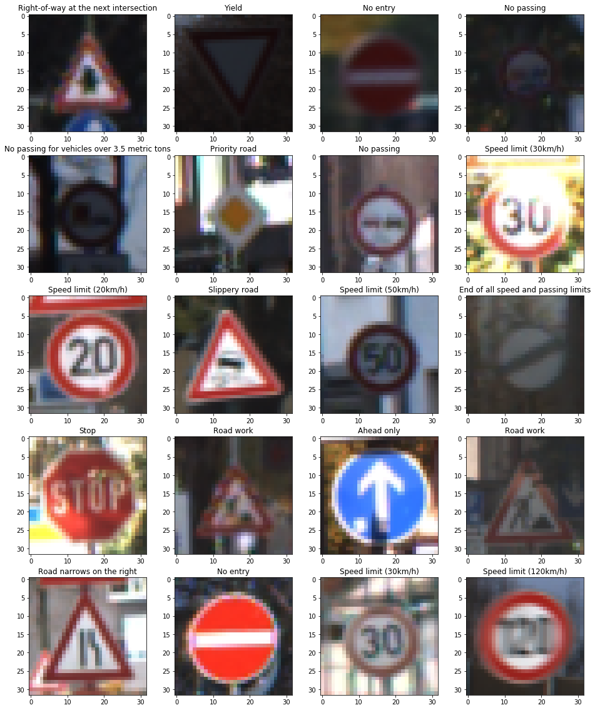

# **Traffic Sign Recognition** 

---

**Build a Traffic Sign Recognition Project**

The goals / steps of this project are the following:
* Load the data set (see below for links to the project data set)
* Explore, summarize and visualize the data set
* Design, train and test a model architecture
* Use the model to make predictions on new images
* Analyze the softmax probabilities of the new images
* Summarize the results with a written report

---
### Writeup / README

[Project code](Traffic_Sign_Classifier.ipynb)

### Data Set Summary & Exploration

#### 1. Basic summary of the data set. 

* The size of training set is 34799
* The size of the validation set is 4410
* The size of test set is 12630
* The shape of a traffic sign image is (32, 32, 3)
* The number of unique classes/labels in the data set is 43

#### 2. Include an exploratory visualization of the dataset.

Here is an exploratory visualization of the data set. It is a bar chart showing the frequency of each class. The requency of classes are consistent through the train, validation, and test sets.

This is a sample of the images.

### Design and Test a Model Architecture

#### 1. Preprocessing
The images are converted into YUV space to follow the baseline in [this paper](http://yann.lecun.com/exdb/publis/pdf/sermanet-ijcnn-11.pdf) and Y channel is selected and normalized.

Here is an example of a traffic sign image before:

And grayscaling only (left) compared to transformed image (right):

I decided to generate additional data since the number of records for each class seems insufficient to train a good model and we experienced over-fitting using the current data. 

To add more data to the the data set, I use augmentation techniques like random rotation, scaling, and translation. I tried 500 images per class, but it didn't seem enough. So I did 10 times more of the original number of images.

Below is an example of an augmented image (right) compared to the grayscale one (left):

#### 2. Architecture

I keep the original LeNet structure with some added dropout layers to reduce over-fitting.
My final model consisted of the following layers:

| Layer         		|     Description	        					| 
|:---------------------:|:---------------------------------------------:| 
| Input         		| 32x32x1 grayscale image   					| 
| Convolution 5x5     	| 1x1 stride, valid padding, outputs 28x28x6 	|
| RELU					|												|
| Max pooling	      	| 2x2 stride,  outputs 14x14x6  				|
| Convolution 5x5	    | 1x1 stride, valid padding, outputs 10x10x16	|
| RELU          		|           									|
| Max pooling			| 2x2 stride, outputs 5x5x16					|
| Flatten				|												|
| Fully Connected		| outputs 200									|		
| RELU					|												|
| Dropout				|												|
| Fully Connected		| outputs 100									|
| RELU					|												|
| Dropout				|												|
| Fully Connected		| outputs 43									|

 

#### 3. Training
To train the model, I used an Adam optimizer, with a learning rate of 0.001, batch size of 128, and 70 epochs. Adam is a good optimizer that combines the benefits of momentum with the benefits of dynamic learning rate from RMSProp. The training seems to plateau after 20 epochs. So training 70 epochs was not necessary.

#### 4. Results
My final model results were: 
* training and validation accuracies are between .94 and .96
* test set accuracy of .93

I first ran the original LeNet architecture without the dropout layers and using only the original data. There was a serious over-fitting problem since the training accuracy was close to 1.0, but validation accuracy was only about .85. 

So there are a few things to fix this:
* More data
* Use an architecture that can generalize better
* Add dropout/regularization
* Augmentation
* Reduce complexity of the architecture

From the previous train session, it looks like we could augment data and add dropout layers. After augmented about 500 more images per class and added dropout layers, I still experienced over-fitting. Therefore, I decided to augmented a lot more data. I also increase the number of outputs for the FC layers. I chose dropout rate of 0.3 by trying multiple times to see which one works best. I was able to get to about .95 training and validation accuracies. Evaluation on the test set yields .93 accuracy.

### Test a Model on New Images

#### 1. Here are five German traffic signs that I found on the web:

 
 
 
 
 

The first image might be mistaken for the 'Keep Left' sign because they look quite similar in both direction of the arrow and the color of the sign.

#### 2. Results of Web Images
Here are the results of the prediction:

| Image			        |     Prediction	        					| 
|:---------------------:|:---------------------------------------------:| 
| Turn right next     	| Keep left   									| 
| Road work     		| Road work										|
| General Caution		| General Caution								|
| Stop	      			| Priority Road					 				|
| Yield					| Yield    			  							|

The model was able to correctly guess 3 of the 5 traffic signs, which gives an accuracy of 60%. This is much lower than the test accuracy of 93%. However, the sample size of 5 is very small.

#### 3. Top softmax probabilities

For the first image, the model got it wrong as it predicts the image to be 'Keep left'. However, it was 'Turn right next' The top five soft max probabilities were

| Probability         	|     Prediction	        					| 
|:---------------------:|:---------------------------------------------:| 
| .34         			| Keep left   									| 
| .12     				| Yield 										|
| .09					| Children crossing											|
| .07	      			| No vehicles					 				|
| .07				    | End of all speed and passing limits     							|

For the second image, the model is relatively sure that this is a Road work sign (probability of 0.68), and the image does contain a Road work sign. The top five soft max probabilities were

| Probability         	|     Prediction	        					| 
|:---------------------:|:---------------------------------------------:| 
| .68         			| Road work  									| 
| .10     				| No passing for vehicles over 3.5 metric tons 										|
| .05					| Dangerous curve to the right											|
| .04	      			| Right-of-way at the next intersection					 				|
| .02				    | Double curve      							|

For the third image, the model is absolutely sure that this is a General caution sign (probability of 1), and it is correct. The top five soft max probabilities were

| Probability         	|     Prediction	        					| 
|:---------------------:|:---------------------------------------------:| 
| 1.00         			| General caution 									| 
| .00     				| Pedestrians  										|
| .00					| Traffic signals											|
| .00	      			| Wild animals crossing					 				|
| .00				    | Road work      							|

For the fourth image, the model guesses incorrectly that it's a Priority Road sign. It's actually a stop sign. The top five soft max probabilities were

| Probability         	|     Prediction	        					| 
|:---------------------:|:---------------------------------------------:| 
| .46         			| Priority road   									| 
| .31     				| Slippery road										|
| .05					| Speed limit (50km/h) 											|
| .02	      			| 	No vehicles				 				|
| .02				    | No passing      							|

For the last image, the model is not very sure that this is a yield sign (probability of 0.29), but it's correct. The top five soft max probabilities were

| Probability         	|     Prediction	        					| 
|:---------------------:|:---------------------------------------------:| 
| .29         			| Yield   									| 
| .11     				| Speed limit (80km/h) 										|
| .07					| Dangerous curve to the right											|
| .06	      			| Turn left ahead 					 				|
| .05				    | Children crossing    							|

